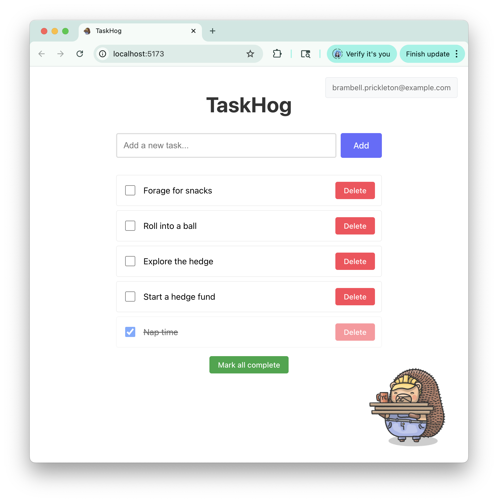

# TaskHog 🦔 

Welcome to TaskHog, a delightfully simple to-do app that helps you stay organized while keeping things fun! Built with React, TypeScript, and powered by PostHog analytics.



This repository serves as an illustration for the PostHog MCP guide on feature flags. The three repository branches reflect three stages of the tutorial:

- `**main**`: starting setup.
- `**finished**`: finished app with working feature flags.
- `**deleted-flag**`: finished app with deleted flags.

### Installation

1. Clone the repository

   ```bash
   git clone <your-repo-url>
   cd taskhog
   ```

2. Install dependencies

   ```bash
   npm install
   ```

3. Set up environment variables
  
   Create a `.env` file in the root directory:

   ```env
   VITE_PUBLIC_POSTHOG_KEY=your_posthog_project_key
   VITE_PUBLIC_POSTHOG_HOST=https://us.posthog.com
   ```

   > **Note:** Replace `your_posthog_project_key` with your actual PostHog project key. If you don't have PostHog set up, you can still run the app - it will work without analytics.

4. Start the development server

   ```bash
   npm run dev
   ```

5. **Open your browser**

Navigate to `http://localhost:5173` and start organizing your tasks! 🎉

## 📝 License

This project is open source and available under the [MIT License](LICENSE).